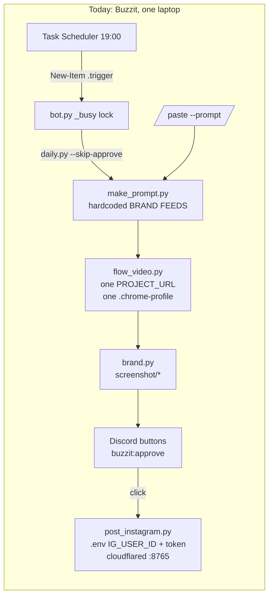
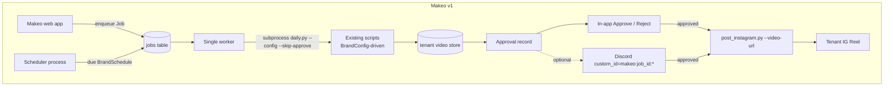
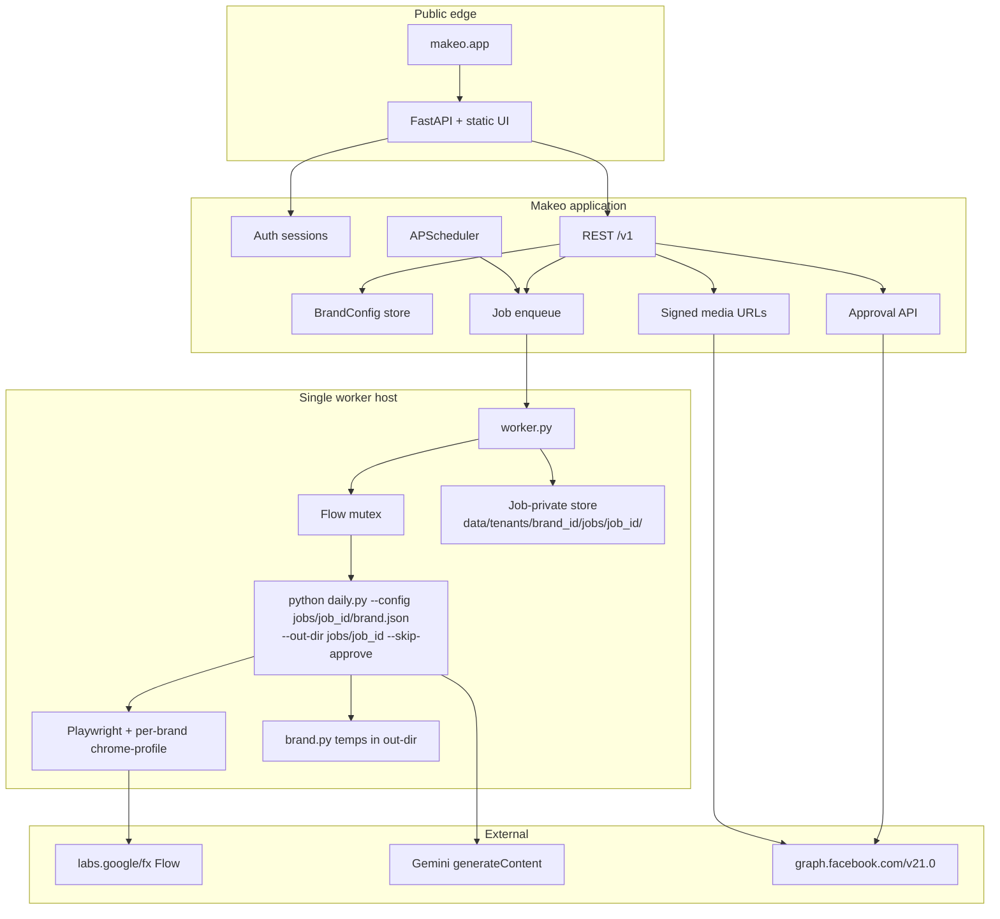
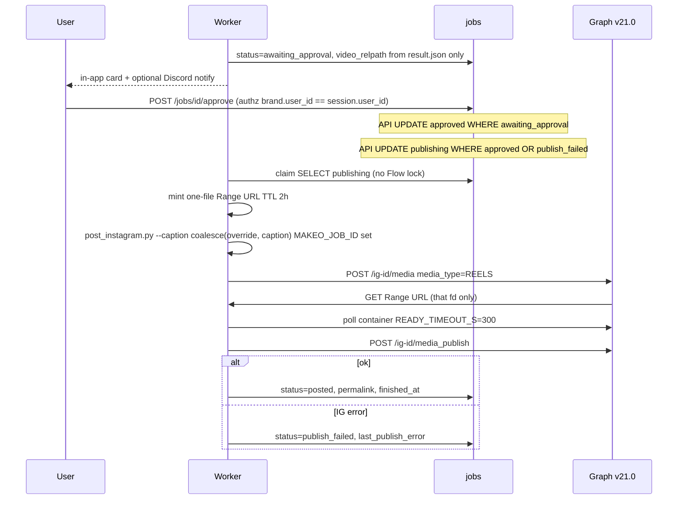
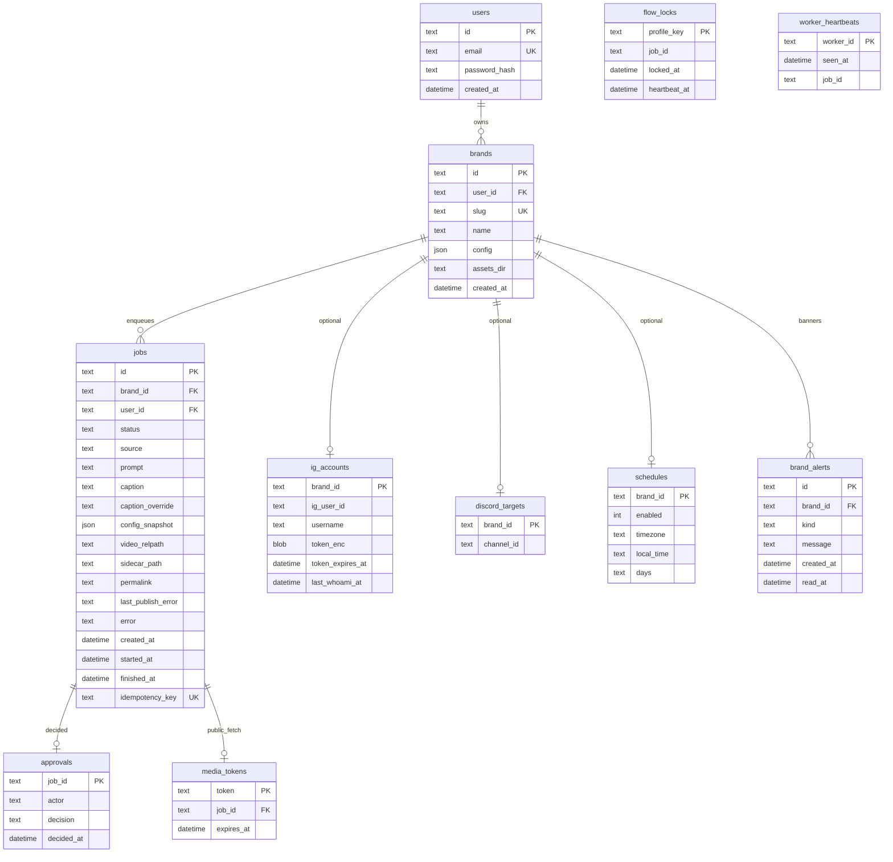
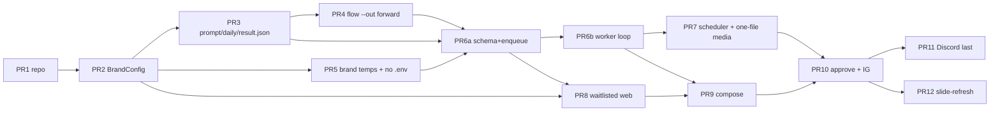

# Makeo: Multi-Brand Content Pipeline Platform

| Field | Value |
|---|---|
| **Title** | Makeo — from Buzzit-only local pipeline to multi-brand generate → brand → approve → Instagram Reel |
| **Author** | _TBD_ |
| **Date** | 2026-08-27 |
| **Status** | Draft (revised 2026-08-27) |
| **Repo** | `/mnt/d/xai/Makeo` (copy of `/mnt/d/xai/Cg`, fresh git) |
| **Audience** | Senior engineers implementing the phased PRs at the bottom of this document |

---

## Overview

Makeo is a website where any brand can run the same pipeline that today exists only for Buzzit: pick or write a Veo prompt, generate an 8-second 9:16 clip via Google Flow, brand it with that tenant's assets, wait for a human to approve, then publish to that tenant's Instagram as a Reel.

v1 does **not** rewrite the pipeline. The existing Python scripts (`daily.py`, `make_prompt.py`, `flow_video.py`, `brand.py`, `approve.py`, `bot.py`, `post_instagram.py`) stay the generation engine. The work is to:

1. Extract every hardcoded Buzzit/India/Hinglish/Discord/IG constant into a per-brand `BrandConfig`.
2. Replace the Windows `.trigger` file and Task Scheduler with a server-side job queue + scheduler.
3. Put a multi-tenant web app in front: **operator-provisioned / waitlisted** brands (not unlimited public signup), brand profile, custom prompt **or** scheduled trend videos, in-app (and optionally Discord) approval.
4. Isolate secrets, Chrome profiles, assets, and videos per tenant.

Human approve-before-publish remains mandatory. Caption-to-video sidecar binding remains mandatory. Auto-post is forbidden. Billing is out of scope. v1 audience is Buzzit plus a small waitlist. **Each brand brings its own Gemini key and Flow login** (Q2/Q3 resolved). Self-serve signup stays waitlisted for product/ops reasons, not because we would be paying model credits.

---

## Background & Motivation

### What exists today (Buzzit-only, one machine)

The current system is a single-tenant, single-machine orchestrator. `daily.py` is a subprocess chain, not a library:

```
Google News IN + Trends IN
        → Gemini gemini-3.6-flash
        → Playwright Google Flow / Veo
        → ffmpeg brand overlay
        → Discord approve
        → Instagram Graph API v21.0 Reel
```

Nothing posts without a click. That invariant is the product.

| Stage | File | What is hardcoded |
|---|---|---|
| Orchestrate | `daily.py` | Writes repo-root `prompt.txt` + `today.json`. Flags: `--public --skip-generate --prompt --ask-prompt --caption --no-brand --skip-approve --screen --no-pip`. **Does not** have `--pip-from` (that is `brand.py`). **Does not** forward `--out` or `--project` today — `run("flow_video.py", "--prompt-file", "prompt.txt", "--headless")` only. |
| Trend → prompt | `make_prompt.py` | `FEEDS` (News `hl=en-IN&gl=IN` + Trends `geo=IN`), `BRAND` (Buzzit pitch), `INSTRUCTIONS` (Hinglish, India-only, Buzzit hook, 120-char caption, 3 hashtags), `MODEL = "gemini-3.6-flash"`. `recent_topics()` reads `out/flow-*.json`. Key: `GEMINI_API_KEY` env only (README says not even `.env`). |
| Generate | `flow_video.py` | `PROJECT_URL = "https://labs.google/fx/tools/flow/project/84c30188-252c-4b46-bdb7-99a4699f66e7"`. Persistent profile `.chrome-profile/`. `GEN_TIMEOUT_S = 900`, `POLL_S = 10`. `download_newest()` writes `out/flow-{unix}.mp4` and copies `today.json` onto the sidecar. |
| Brand | `brand.py` | PiP `screenshot/feedscreen.png` from `--pip-from` default `4.0`s, gold border `0xE8B84B`, end-card `screenshot/splash_video.gif` for `END_S = 3.0`s. IG 2207077 mitigations: High@4.0, `-shortest`, probed sample rate, `+faststart`, CRF 23. Sidecar copied to `*-branded.json`. |
| Approve (legacy) | `approve.py` | Stdlib page + cloudflared + `CHAT_WEBHOOK`. Module-level `DECISION` dict. One pending video. Default port `APPROVE_PORT=8770`. |
| Approve (prod) | `bot.py` | `/post`, persistent buttons `custom_id=buzzit:approve\|reject`, `.trigger` IPC polled every 10s, `_busy = asyncio.Lock()`, `DISCORD_BOT_TOKEN` + `DISCORD_CHANNEL_ID` (channel id missing from `.env.example`). Restart falls back to newest `out/flow-*-branded.mp4`. Hardcodes `@buzzit_official`. |
| Publish | `post_instagram.py` | Graph `v21.0`, Range HTTP server + cloudflared `--serve` on port `8765`. **Publish path** (lines 385–389) does **not** use `DEFAULT_IG_ID`; it `load_env()`s via `os.environ.setdefault` and reads `IG_USER_ID` / `IG_ACCESS_TOKEN` from process env / repo `.env`. `DEFAULT_IG_ID = "17841441421691063"` `@buzzit_official` is a **setup** fallback in `finish_setup()` and `--save-token` only. `IG_USERNAME` defaults to `"buzzit_official"`. `write_env()` rewrites repo-root `.env`. Tokens ~60 days. `READY_TIMEOUT_S = 300`. |
| Schedule | `schedule_daily.ps1` / `run_daily.ps1` | Windows Task `BuzzitDaily` at **19:00 local**. Token check via `post_instagram.py --whoami`, then `New-Item .trigger`. Bot task `BuzzitBot` at logon (`schedule_bot.ps1`). |
| Dead leftover | `n8n-genz-daily.json` | Superseded. Do not build on it. |

`daily.py.write_manual_prompt()` already implements the custom-prompt path the site needs: it writes the **same** `prompt.txt` + `today.json` shape as `make_prompt.py`, so downstream is unchanged. Manual caption default is `"Buzz. Share. Earn. Only on Buzzit 💸 #Buzzit #CreatorEconomy"`.

Sidecar contract (must survive the rewrite):

```json
{
  "topic": "...",
  "why_genz": "...",
  "buzzit_link": "...",
  "veo_prompt": "...",
  "caption": "..."
}
```

`flow_video.py` copies `today.json` onto `out/flow-{ts}.json` because a later `make_prompt.py` run overwrites the globals — that mismatch already shipped a dating-app clip captioned about saving money. `brand.py` copies the sidecar onto `*-branded.json`. `post_instagram.py` prefers the sidecar next to **this** video over `today.json`.

### Why this cannot stay as-is

Every per-tenant concern is a module-level constant or a single machine path:

- One Chrome profile (`.chrome-profile/`). Playwright `launch_persistent_context` cannot share it. Two concurrent Flow jobs corrupt the profile or burn credits twice. `bot.py` already serializes with `_busy` and documents this as "one job at a time".
- One Flow project URL. One IG business account. Publish binds via host `.env` (`load_env` + `setdefault`). `DEFAULT_IG_ID` is only a setup-time fallback (`finish_setup` / `--save-token`).
- One Discord bot, one channel, buttons namespaced `buzzit:*`.
- One asset pack (`screenshot/{feedscreen.png,splash_video.gif,logo.png,Profile.png,withdraw.png}`).
- One locale (India / Hinglish / Gen Z).
- One schedule (Windows 19:00, task name `BuzzitDaily`).
- One video directory (`out/`). `newest_video()` is "latest mtime in a shared folder" — fatal under two brands.
- Approval durability is Discord-only. `approve.py`'s cloudflared page already lost a click to a 502; `bot.py` exists because of that.

The site named **Makeo** is the productization of this pipeline, not a new generator.

---

## Goals & Non-Goals

### Goals

1. A website named **Makeo** where an **operator-provisioned / waitlisted** user gets a brand profile and either pastes a Veo prompt or enables a per-brand schedule. Unlimited public signup is **not** v1.
2. Every Buzzit-specific input becomes per-brand configuration (full list in [Per-brand input list](#per-brand-input-list-complete)).
3. Human approval is mandatory on every publish path. There is no `--auto-post`, no "skip approve if scheduled".
4. Caption stays bound to its video via the sidecar (or an equivalent DB row written at download time and never mutated by a later prompt run).
5. v1 reuses the existing scripts as subprocesses. Same flags, same ffmpeg recipe, same Graph publish, same Flow scraper.
6. **One Flow / brand job globally at a time** in v1 — even if a brand later brings its own Flow profile. No parallel `brand.py`.
7. Tenant isolation of secrets, assets, videos, and IG tokens.
8. Incremental, mergeable PRs. First PRs make the scripts brand-configurable so Buzzit itself keeps working from a config file.

### Non-Goals (v1)

- Billing, plans, usage metering, Stripe. Future.
- Rewriting Veo generation against an official API. Flow stays UI scraping. A later swap is an adapter behind `flow_video.py`.
- Rewriting `brand.py` in a new editor (Remotion, MoviePy). The 2207077 mitigations stay.
- Building on `n8n-genz-daily.json`.
- Multi-region / multi-worker Flow. One worker process owns Flow.
- TikTok / YouTube Shorts / multi-destination. Instagram Reel only.
- In-video phone-screen warping. PiP inset + end-card only, as today.
- Mobile native apps.
- Collaborative brand teams beyond "one owner + optional Discord channel".
- Guaranteeing Flow availability or Veo quality. We surface failures; we do not retry blindly (credits).

---

## Proposed Design

### Current vs target flow





### Component map



**Why FastAPI + the existing scripts, not a rewrite.** The pipeline's value is in the ponytail comments: Flow selectors, IG 2207077 bisects, sidecar overwrite bug, Discord 3-second interaction deadline, Range requests. Those stay in Python files that already run. The web app is a control plane.

**Why one worker.** `flow_video.py` owns a persistent Chrome profile. `bot.py` already refuses concurrency (`Already generating -- one at a time.`). v1 freezes this as **one job globally** (D19), including BYO Flow: two concurrent `brand.py` runs would collide on repo-global temps `_withpip.mp4` / `_endcard.png` / `_endcard.mp4`. The queue absorbs burst; the worker serializes. Deployment is **one API process + one worker process** (no `uvicorn --workers 2`).

### Per-brand input list (complete)

Everything a tenant must be able to set. Not only "prompt, Instagram, Discord".

#### Identity & voice (today: `BRAND` + `INSTRUCTIONS` in `make_prompt.py`)

| Field | Today | Makeo |
|---|---|---|
| `name` | `"Buzzit"` | Brand display name |
| `slug` | implicit | URL-safe unique id |
| `pitch` | `BRAND` multiline (Indian short-video + live + coins + UPI) | Free-text "what we sell" |
| `hook` | "The video must end on the Buzzit hook: making money from the reels you already make." | Required spoken CTA |
| `tone` | "Gen Z Hinglish register" | Tone / register |
| `locale.language` | Indian English / Hinglish | BCP-47, e.g. `en-IN`, `en-US` |
| `locale.region` | India, `gl=IN`, `geo=IN` | ISO region for feeds + prompt geography |
| `locale.setting_rule` | "Set it in INDIA with Indian people... This is non-negotiable." | Geography constraint text |
| `audience` | Gen Z | Who the ad is for |
| `forbidden_topics` | "no political side, name no politician or party, skip grim/tragic/communal" | List + free text |
| `phone_screen_rule` | Hardcoded Buzzit feed description with gold accent icons | Optional product-screen description, or "no phones" |
| `instructions_template` | `INSTRUCTIONS` string in `make_prompt.py` | **Required.** Full template with placeholders `{brand}` `{headlines}` `{recent}` `{hook}` `{setting_rule}` `{phone_screen_rule}` `{caption_template}` plus optional `{tone}` `{audience}` `{forbidden_topics}`. Unknown placeholders fail `brand_config` load. Discrete fields only fill placeholders; `tone` / `audience` / `forbidden_topics` have **no effect** unless the operator pastes those tokens into the template. |
| `model` | `gemini-3.6-flash` | Default that; overridable |

#### Generation source

| Field | Today | Makeo |
|---|---|---|
| `mode` | CLI: omit `--prompt` (trend) or pass `--prompt` / `--ask-prompt` | `custom` \| `scheduled_trend` \| both allowed |
| `rss_feeds[]` | `FEEDS` two URLs | **v1: not free-form.** Hostname allowlist `news.google.com` + `trends.google.com` only. A query builder emits those URLs from `locale.region`. Arbitrary RSS is deferred (SSRF). |
| `rss_query` | `when:1d+gen+z+OR+viral+OR+trending` | Optional query string, baked into the allowlisted Google News URL |
| `headline_limit` | `headlines(limit=25)` | Default 25 |
| `dedup_max_topics` | `recent_topics(days=10)` — **count**, not calendar days; stops after N unique topics (`make_prompt.py` 77–78) | Per-brand count, default 10. Do **not** implement real calendar days (would change Buzzit). |
| `custom_prompt` | `daily.py --prompt` | Pasted Veo prompt |
| `veo_constraints` | 8s, 9:16, no text/logos/watermarks | Defaults stay; user cannot disable "no overlays" (we brand later) |

#### Caption

| Field | Today | Makeo |
|---|---|---|
| `caption` | Gemini output, or `--caption`, or Buzzit default string | User-supplied for custom; Gemini for trend |
| `caption_template` | "max 120 chars, mention Buzzit, 3 hashtags max" | Template + `{brand}` placeholder |
| `caption_max_chars` | 120 | Default 120 |
| `hashtag_max` | 3 | Default 3 |
| sidecar fields | `topic`, `why_genz`, `buzzit_link`, `veo_prompt`, `caption` | Rename `buzzit_link` → `brand_link`, keep reading the old key |

#### Branding assets (today: `screenshot/`)

| Field | Today | Makeo |
|---|---|---|
| `assets.logo` | `screenshot/logo.png` | Uploaded PNG |
| `assets.splash` | `screenshot/splash_video.gif` (270x480 9:16) | Uploaded gif/mp4/png |
| `assets.pip_image` | `screenshot/feedscreen.png` | Uploaded PNG |
| `assets.endcard_screens` + `CROP` | `withdraw.png` `(0.07, 0.45)`, `Profile.png` `(0.0, 0.72)`, `feedscreen.png` `(0.0, 1.0)` in `brand.py` | **Not v1 tenant inputs.** `CROP` stays in `brand.py` as Buzzit defaults. Optional per-asset metadata later. v1 tenants upload logo / splash / pip only. |
| `pip.enabled` | on unless `--no-pip` | Boolean, default on if `pip_image` present |
| `pip.from_s` | `--pip-from` default `4.0` | Float |
| `pip.border_color` | `0xE8B84B` | Hex |
| `endcard.seconds` | `END_S = 3.0` | Float |
| `endcard.mode` | splash gif unless `--screen` | `splash` \| `static` |
| `brand_colors.primary` | gold | Hex, used for PiP border default |

#### Instagram

| Field | Today | Makeo |
|---|---|---|
| `ig.user_id` | Publish: `.env IG_USER_ID` (no `DEFAULT_IG_ID`). Setup: `DEFAULT_IG_ID` in `finish_setup` / `--save-token` | Per-brand in `ig_accounts`. **No process `.env`, no `DEFAULT_IG_ID`** on the Makeo publish path. |
| `ig.username` | `IG_USERNAME` default `buzzit_official` | Per-brand; no Buzzit default when job-scoped |
| `ig.access_token` | `.env IG_ACCESS_TOKEN` via `load_env`/`setdefault` | Encrypted in `ig_accounts.token_enc` (DB is source of truth). Worker injects a **copy** of `os.environ` into `subprocess.run(..., env=)`. |
| `ig.token_expires_at` | `--whoami` prints remaining life | Stored; warn < 48h (same threshold as README) |
| `ig.auth_method` | paste token / `--finish-setup` | v1: paste long-lived token. v1.1: Facebook Login OAuth (open question) |

#### Discord (optional)

| Field | Today | Makeo |
|---|---|---|
| `approval.channels` | Discord only in prod | `in_app` required; `discord` optional |
| `discord.channel_id` | `DISCORD_CHANNEL_ID` | Per-brand channel, or none |
| `discord.webhook` | `CHAT_WEBHOOK` (legacy `approve.py`) | Not required if in-app |

Platform bot token (`DISCORD_BOT_TOKEN`) stays a **platform** secret, not a tenant input. Tenant supplies a channel the Makeo bot is invited to.

#### Flow / Gemini / runtime

| Field | Today | Makeo |
|---|---|---|
| `gemini.api_key` | process env `GEMINI_API_KEY` | **Required BYO.** Encrypted in DB (`secrets` table, `kind=gemini_key`). Decrypt only into the **subprocess** env copy after the pop-list. Never a platform default. Never mix brand A’s key onto brand B’s job. |
| `flow.project_url` | `PROJECT_URL` constant | **Required BYO.** Stored on the brand (no secrets). Worker passes `--project` from the job snapshot. |
| `flow.profile_dir` | `.chrome-profile/` | **Required BYO** after `flow_video.py --login` into `data/tenants/{id}/chrome-profile/`. Never mix brand A’s profile with brand B. v1 still **serializes one generate job globally** (D19) so `brand.py` temps and Chrome `SingletonLock` cannot collide. |
| `schedule.enabled` | Task exists or not | Boolean |
| `schedule.timezone` | machine local | IANA TZ, required if scheduled |
| `schedule.local_time` | `19:00` | `HH:MM` |
| `schedule.days` | daily | List of weekdays, default all |
| `schedule.skip_if_token_dead` | `run_daily.ps1` aborts on `--whoami` fail | Always on |

### BrandConfig extracted from scripts

New module `brand_config.py` (stdlib + json) is the only thing scripts import. No web framework in the pipeline.

```python
# brand_config.py — loaded by every script; no FastAPI import
from dataclasses import dataclass, field
from pathlib import Path
import json

SCHEMA_VERSION = 1

@dataclass
class Locale:
    language: str = "en-IN"
    region: str = "IN"
    setting_rule: str = ""

@dataclass
class BrandConfig:
    schema_version: int = SCHEMA_VERSION
    brand_id: str = ""
    name: str = ""
    slug: str = ""
    pitch: str = ""
    hook: str = ""
    tone: str = ""
    locale: Locale = field(default_factory=Locale)
    audience: str = ""
    forbidden_topics: list[str] = field(default_factory=list)
    phone_screen_rule: str = ""
    instructions_template: str = ""   # required; unknown {placeholders} fail load
    feeds: list[str] = field(default_factory=list)  # allowlisted hosts only
    rss_query: str = ""
    headline_limit: int = 25
    dedup_max_topics: int = 10        # count of unique topics, NOT calendar days
    caption_template: str = ""
    caption_max_chars: int = 120
    hashtag_max: int = 3
    model: str = "gemini-3.6-flash"
    pip_enabled: bool = True
    pip_from_s: float = 4.0
    pip_border_color: str = "0xE8B84B"
    endcard_seconds: float = 3.0
    endcard_mode: str = "splash"          # splash | static
    assets_dir: str = ""                  # absolute path to tenant assets
    out_dir: str = ""                     # absolute path to tenant videos
    flow_project_url: str = ""
    flow_profile_dir: str = ""
    # Secrets are NOT in this file. Never ig tokens, never Gemini keys.
    # Worker injects IG_USER_ID / IG_ACCESS_TOKEN via subprocess env= copy.
```

`brand_config.load(path)` interpolates

```python
instructions_template.format(
    brand=pitch, headlines=..., recent=..., hook=hook,
    setting_rule=locale.setting_rule, phone_screen_rule=phone_screen_rule,
    caption_template=caption_template,
    tone=tone, audience=audience,
    forbidden_topics=", ".join(forbidden_topics),
)
```

A leftover `{name}` that is not in that set is a load error. `tone`, `audience`, and `forbidden_topics` are first-class BrandConfig / wizard fields but are **unused unless the template contains those placeholders** — filling the list alone does not change Gemini. The **full current `INSTRUCTIONS` string** from `make_prompt.py` (with the required placeholders substituted for the hard-coded Buzzit sentences) lives in `brands/buzzit.json` as `instructions_template`. The Buzzit manual-caption slogan lives only in that json (or as a Buzzit-only default when `--config` is omitted).

On-disk layout (worker host):

```
/mnt/d/xai/Makeo/
  brand_config.py
  daily.py
  ...
  data/
    makeo.db                    # source of truth for tokens (ig_accounts.token_enc)
    tenants/
      {brand_id}/
        brand.json              # live BrandConfig, no secrets (next enqueue)
        assets/                 # live uploads (next enqueue)
          logo.png
          splash_video.gif
          pip.png
        jobs/
          {job_id}/             # materialized at enqueue; worker ONLY uses this prefix
            brand.json          # config_snapshot bytes
            assets/             # copies of logo/splash/pip at enqueue
            prompt.txt
            today.json
            result.json         # {job_id, video, sidecar, exit}
            flow-{job_id}.mp4
            flow-{job_id}.json
            flow-{job_id}-branded.mp4
            flow-{job_id}-branded.json
        chrome-profile/         # BYO Flow session after --login; never mix brands
```

There is **no** `secrets.json.enc` on the worker input path. DB (`ig_accounts.token_enc`, `secrets` table for **required** BYO `GEMINI_API_KEY`) is the only store the worker decrypts. Flow cookies live only in that brand’s `chrome-profile/` (0600, never served).

Scripts grow flags; they do not grow HTTP. Worker invoke (job-scoped):

```
# worker.py must NOT call load_env(). Build env from a pop-list, then set tenant/platform values.
python daily.py --config data/tenants/{id}/jobs/{job_id}/brand.json \
                --out-dir data/tenants/{id}/jobs/{job_id} \
                --history-dir data/tenants/{id}/jobs \
                --skip-approve
# daily.py forwards --profile-dir data/tenants/{id}/chrome-profile
# (live BYO session; not copied into the job snapshot)
# daily.py, when MAKEO_JOB_ID is set:
#   writes out_dir/result.json and prints MAKEO_RESULT=<json>
#   names Flow output flow-{job_id}.mp4
#   forwards --out {out_dir} --project --profile-dir --prompt-file {out_dir}/prompt.txt
#   forwards --history-dir to make_prompt.py

python post_instagram.py --video …/flow-{job_id}-branded.mp4 \
                         --video-url https://makeo.app/public/media/{job_id}/{secret} \
                         --caption "$CAPTION"   # coalesce(jobs.caption_override, jobs.caption)
# MAKEO_JOB_ID always set on this subprocess. When MAKEO_JOB_ID or --config is set:
# do NOT load_env(), do NOT read repo .env, hard-fail if IG_USER_ID or IG_ACCESS_TOKEN missing.
```

`write_manual_prompt()` and `make_prompt.py` write `prompt.txt` + `today.json` **inside `--out-dir`**, not repo root. That is the first real concurrency fix: two brands can no longer clobber each other's globals.

`recent_topics()` must **not** glob `--out-dir` alone. After D18, `--out-dir` is `data/tenants/{id}/jobs/{job_id}/`, which is empty of sidecars when `make_prompt.py` runs. `make_prompt.py` takes `--history-dir` (Makeo worker passes `data/tenants/{id}/jobs/`), globs `*/flow-*.json`, skips `*-branded`, caps at `dedup_max_topics`. Default `--history-dir` to `--out-dir` so Buzzit-without-Makeo still reads repo `out/`. Never read another tenant's tree. Unit test (PR 3): two sibling job dirs with topics, current job dir empty → both topics appear under "Already covered."

### Job worker and queue (replaces `.trigger`)

Today: `run_daily.ps1` writes `HERE / ".trigger"`; `bot.py.watch_trigger()` polls every 10s, unlinks the file, and runs `generate_and_offer`. Empty file = trend path; file body = custom prompt. If `_busy.locked()`, the scheduled run is **skipped** (not queued). Restart loses nothing because the file is the only state — except a crash between unlink and finish drops the day.

Target: a `jobs` table is the queue. The worker is the only process that runs `daily.py`. The Discord bot **never** writes `jobs` and **never** calls `daily.py`; it only `POST`s `/internal/jobs/{id}/discord-approve` (see Discord).

```
Job.status:  queued → running → awaiting_approval → approved → publishing → posted
                                  ↘ rejected
                                  ↘ failed                  # generate/brand crash; no video
             queued → cancelled
             approved → publishing → publish_failed         # IG failed; video kept
             publish_failed → publishing                    # retry-publish
```

`retry-publish` is allowed only from `publish_failed` (or equivalently `status='approved' AND last_publish_error IS NOT NULL` if we collapse the enum — v1 uses explicit `publish_failed`). Generate `failed` is not retry-publishable.

Rules:

- Enqueue is always allowed (user clicked Generate, or scheduler catch-up fired) subject to waitlist + per-brand caps.
- **Worker claim loop (D20).** Each tick claims **exactly one** job, never both in the same tick:
  1. Prefer `SELECT … WHERE status='publishing' ORDER BY created_at LIMIT 1` → **publish pass**. IG only. **Do not** take `flow_locks`. Invoke `post_instagram.py` (not `daily.py`).
  2. Else `SELECT … WHERE status='queued' ORDER BY created_at LIMIT 1` → **generate pass**. Take `flow_locks.profile_key='global'`. Invoke `daily.py --skip-approve`.
  Under `BEGIN IMMEDIATE` (single worker; no `SKIP LOCKED` needed in v1). A 300s IG poll must not hold the Flow lock or catch-up generates stall behind Graph.
- **Who flips to `publishing`:** the API on approve / retry-publish, not the worker: `UPDATE jobs SET status='publishing', caption_override=COALESCE(?, caption_override) WHERE id=? AND status IN ('approved','publish_failed')`. Approve itself is `UPDATE … SET status='approved', caption_override=? WHERE status='awaiting_approval'` then immediately the flip above (one request, two statements). Retry-publish is the same flip from `publish_failed`.
- **Publish subprocess always** passes `--caption` from `coalesce(jobs.caption_override, jobs.caption)` and sets `MAKEO_JOB_ID` (so `load_env()` stays off). Current `post_instagram.py` (391–400) uses `--caption` if given, else the sidecar — omitting `--caption` would post the Gemini string after an inbox edit.
- **One running generate job globally**, even for a future BYO profile. Enforced by a single `flow_locks` row (`profile_key='global'`). Publish jobs do not take this lock. `brand.py` temps move to `--out-dir` or `tempfile` so a future relaxation does not corrupt encodes.
- Scheduler never skips a day because a job is running; it enqueues. Backlog is visible in the UI.
- Dead IG token: insert a `failed` job with `idempotency_key=sched:{brand}:{date}` and `error=ig_token_invalid`, plus an in-app `brands.alerts[]` banner. Do **not** spend Flow credits. The key prevents retrying all day.
- Crash while `running`: on boot, jobs `running` older than **`2400s + encode budget`** (~45 min; matches today's `bot.py` `daily.py` timeout of 2400s, not the 20 min `GEN_TIMEOUT_S + 2 min` underestimate) are marked `failed` with `worker_crash`. Do not auto-retry (credits). Also **release stale `flow_locks` and kill Chrome processes whose `--user-data-dir` is a known profile** (orphan `SingletonLock` otherwise blocks the next job).
- **Result contract (D16).** `daily.py --skip-approve` MUST write `out_dir/result.json`:

```json
{"job_id": "01J...", "video": "flow-01J...-branded.mp4", "sidecar": "flow-01J...-branded.json", "exit": 0}
```

  and/or print a single parseable line `MAKEO_RESULT={"job_id":"...","video":"...","sidecar":"...","exit":0}`. Outputs are named `flow-{job_id}.mp4` via `MAKEO_JOB_ID` forwarded into `flow_video.py`. The worker sets `jobs.video_relpath` **only** from that handle. If the file is missing, empty, or `exit != 0`, status=`failed`, **never** `awaiting_approval`.
- **`newest_video()` is deleted from the worker and bot path in PR 6**, not PR 11. `daily.py.newest_video()` may remain as a local-dev helper when `MAKEO_JOB_ID` is unset; the worker must not call it.
- Test (PR 6b): two branded files already in the tenant tree, brand step fails, job must not pick the older success.
- Test (PR 10): approve with a `caption_override` → posted Reel text equals the override; sidecar file on disk is unchanged.

Job payload (minimum; columns match the `jobs` table):

```python
{
  "id": "01J...",                 # also MAKEO_JOB_ID; filename stem
  "brand_id": "...",
  "user_id": "...",
  "source": "ui_custom" | "ui_trend" | "schedule",
  "prompt": null | str,          # None → make_prompt.py
  "caption": null | str,
  "caption_override": null,      # ONE column; set at approve. Not on approvals.
  "config_snapshot": { ... },    # BrandConfig JSON at enqueue (repro)
  "video_relpath": null,         # ONLY from result.json / MAKEO_RESULT
  "sidecar_path": null,          # from the same handle
  "permalink": null,
  "last_publish_error": null,
  "error": null,
  "created_at": "...",
  "started_at": null,
  "finished_at": null,
  "idempotency_key": null
}
```

**Enqueue materializes a job-private directory** (D18): persist `config_snapshot` on the row **and** write `data/tenants/{id}/jobs/{job_id}/` with `brand.json` (snapshot) plus copies of logo/splash/pip. Worker `--config` / `--assets-dir` / `--out-dir` point **only** under that prefix. Live `brand.json` and `assets/` are for the next enqueue. `Path.resolve()` of every worker path must stay inside that prefix or the job fails closed.

### Where videos live

| Phase | Location | Public? |
|---|---|---|
| Raw Flow download | `data/tenants/{brand_id}/jobs/{job_id}/flow-{job_id}.mp4` | No |
| Sidecar | same stem `.json` | No |
| Branded | `flow-{job_id}-branded.mp4` + `.json` | No |
| Result manifest | `result.json` in that same directory | No |
| Approval preview | `GET /v1/jobs/{id}/preview` after `brand.user_id == session.user_id`. Range on **that job's** `video_relpath` only. | Authenticated |
| Discord preview | If file ≤ `MAX_UPLOAD = 8 * 1024 * 1024` (the CRF 23 reason), upload to Discord. Else link to the authenticated preview. | Discord CDN / login |
| IG fetch | Instagram **will not accept a local file**. Today: cloudflared quick tunnel on `:8765` + `RANGE_SERVER` which `os.chdir(video.parent)` and serves the **whole directory**. Target: a **durable, unguessable HTTPS URL** for **one file**, Range, valid for ≥ `READY_TIMEOUT_S` (300s) plus margin. | Time-limited public |

v1 media URL: the Makeo app itself, `https://<host>/public/media/{job_id}/{secret}`. Token 32 random bytes, TTL 2 hours.

**Do not extract the `chdir` `RANGE_SERVER`.** That handler serves every sibling under `video.parent` — Instagram (or anyone with the tunnel URL) can request other `flow-*.mp4` / `.json` files by name. The new handler:

1. Looks up `media_tokens` by `{job_id, secret}`; 404 if missing/expired.
2. Loads `jobs.video_relpath`, `Path.resolve()`, asserts the path is under `data/tenants/{brand_id}/jobs/{job_id}/`.
3. Answers Range against **that fd only**. No directory listing, no sibling paths.
4. Test: `GET /public/media/{job}/{secret}/../other.mp4` and `GET ...?path=../other.mp4` are 404.

No cloudflared in the publish path. Cloudflare Tunnel or a reverse proxy in front of the app is ops, not a per-job process.

Do **not** put tenant videos in a shared `out/`. Do **not** bind a job to "newest in `--out-dir`". The worker has no `newest_video()` call.

Retention v1: keep last 30 videos per brand; UI can download. No CDN purge story yet.

### Approval without dying cloudflared pages

Two systems exist. Only one is acceptable as the product default.

| Path | Durability | Multi-tenant | Verdict |
|---|---|---|---|
| `approve.py` + cloudflared | Process + tunnel. 502 already ate a click. State is a module-level `DECISION` dict. | One pending video by design. | **Do not use for Makeo.** Keep file as a manual debug tool only. |
| `bot.py` persistent views | `timeout=None` + `custom_id`. `setup_hook` re-`add_view(Approval())` so restarts don't orphan buttons. Falls back to **newest branded mp4** — wrong under two brands. | `custom_id="buzzit:approve"` is global. Channel is one env var. | Reusable **only** as a remote control: parse `custom_id=makeo:{job_id}:approve`, ack within 3s, `POST /internal/...`. **Do not** `add_view(Approval())`. Bot never writes `jobs`. |
| In-app approval | Job row is the source of truth. Buttons are just mutations: `POST /v1/jobs/{id}/approve`. Preview is an authenticated video. | Native. | **v1 required path.** |

Mandatory rules:

- Approve / Reject: `UPDATE jobs SET status='approved', caption_override=? WHERE id=? AND status='awaiting_approval'` (approve) or `… status='rejected' WHERE status='awaiting_approval'` (reject). Then, in the same request, the API flips publishable rows: `UPDATE jobs SET status='publishing' WHERE id=? AND status IN ('approved','publish_failed')`. Double-click is idempotent (0 rows updated → no-op). The worker does **not** flip `approved → publishing`.
- Publish is a second worker pass claimed from `status='publishing'` with **no Flow lock**. Success → `posted` + `permalink` + `finished_at`. IG failure → `publish_failed` + `last_publish_error`. Retry-publish is the same API `UPDATE … WHERE status IN ('approved','publish_failed')`. The user retries **without regenerating**. Generate `failed` is a different state and has no video. The publish subprocess always passes `--caption coalesce(caption_override, caption)` and `MAKEO_JOB_ID`.
- Discord, if enabled, is notification + remote control only. `custom_id=makeo:{job_id}:approve|reject` (ULID fits in Discord's 100-char limit). Bot: parse `custom_id`, `interaction.response.defer()` or `edit_message` **immediately** (3s deadline — same reason as `bot.py` 80–86), then `POST /internal/jobs/{id}/discord-approve` with `X-Makeo-Worker-Key`. Register **one** prefix handler (`on_interaction` / `DynamicItem`). **Do not** `add_view(Approval())`. Bot never writes `jobs`, never calls `newest_video()`, never subprocesses `post_instagram.py`.
- No public unauthenticated approve URL. `approve.py`'s tunnel page is gone from the scheduled path.
- Every job mutation from the session API repeats `brand.user_id == session.user_id`.



### Server-side scheduler (replaces per-user Task Scheduler)

`schedule_daily.ps1` registers one interactive-logon task at 19:00 named `BuzzitDaily`. That model does not scale to N brands, N timezones, or a Linux worker.

Makeo runs the scheduler **inside the single API process** (a 60s loop; APScheduler is optional). **One API process, one worker process**, both started from the cloned repo. `uvicorn --workers 2` is forbidden — it would double-fire the scheduler against the same SQLite file. On Windows (first host): two long-running `python` processes (Startup folder / NSSM optional). systemd/supervisor is fine on a later Linux host.

Every minute, for each brand with `schedule.enabled`:

1. Compute "now" **in `schedule.timezone`**. Do **not** precompute a UTC fire time (DST would double-fire or skip).
2. If local weekday is in `schedule.days` **and** local now ≥ `schedule.local_time` **and** there is no row with `idempotency_key=sched:{brand_id}:{yyyy-mm-dd}` (that brand's local date): this is a **catch-up**. Enqueue. A process down across 19:00 still ships the day when it returns (same intent as `-StartWhenAvailable` in `schedule_daily.ps1`).
3. A restart at 19:00:40 cannot double-enqueue because of the unique key.
4. Preflight IG token (`ig_accounts.token_expires_at` and an in-process `probe_ig()` — **not** `post_instagram.py --whoami` against repo `.env`). If dead: **insert** a `failed` job with that same `idempotency_key` and `error=ig_token_invalid`, append `brands.alerts[]` (`token_dead`, in-app banner on Home/Settings). Do not generate. The failed row occupies the day's key so the loop does not retry every minute.
5. Else insert `jobs` with `source=schedule`, `prompt=null`, and materialize the job-private snapshot dir.

The Windows scripts remain valid as a **dev** way to run Buzzit's own brand against Makeo locally. They are not the product scheduler.

`schedule_bot.ps1` / `run_bot.ps1` become optional (Phase 4): only if any brand opted into Discord approval. The bot no longer watches `.trigger` and no longer calls `daily.py`. It only calls `POST /internal/jobs/{id}/discord-approve` with `X-Makeo-Worker-Key` on loopback.

### Web app: waitlisted accounts, brand profile, custom prompt OR schedule

v1 is **waitlisted / operator-provisioned brands**, not unlimited public signup. Phase 2–3 fit Buzzit + one test brand. Q2/Q3 are decided (BYO keys) so **our** credit budget is not the signup blocker; signup stays waitlisted until ops can support more than a handful of BYO Flow profiles. Password reset / email verify are omitted until then.

v1 surface area:

1. **Auth** — email + password, session cookie (`HttpOnly`, `Secure`, `SameSite=Lax`) **plus** a synchronizer CSRF token in a separate non-`HttpOnly` cookie (or hidden form field). Lax alone does not stop all POSTs. Operator creates the user row; self-serve signup stays behind a waitlist flag. One user owns N brands (v1: cap at 3, no billing).
2. **Brand onboarding wizard**
   - Name, pitch, hook, tone, locale, forbidden topics, `instructions_template` (or the Buzzit default).
   - Upload logo, splash, PiP (v1 shows the files; live end-card preview later).
   - Instagram: paste `IG_USER_ID` + long-lived token. Server calls extracted `exchange_token()` / `probe_ig()` that **return values**. Persist only to `ig_accounts.token_enc`. **Never** call `write_env()`. **Never** reuse `finish_setup()` as-is. Refuse Personal accounts (already documented in `post_instagram.py` SETUP).
   - Discord is **not** in the v1 wizard (Phase 4 only). Approval is in-app.
   - Mode: "I'll paste prompts" and/or "Schedule trend videos" (timezone + time).
   - **Gemini (required):** paste `GEMINI_API_KEY`. Persist encrypted to `secrets` (`kind=gemini_key`). Refuse enqueue if missing.
   - **Flow (required):** brand supplies a Flow project URL and completes `flow_video.py --login` into `data/tenants/{id}/chrome-profile/` on the worker host (operator-assisted in v1; not a hosted remote-desktop UI). Refuse generate if the profile dir is missing. Never reuse another brand’s profile.
3. **Home**
   - Compose: textarea (Veo prompt) + caption + Generate. Enqueues `ui_custom`.
   - Or "Generate from today's trends" — enqueues `ui_trend`.
   - Queue position (because Flow is serialized).
   - `brands.alerts[]` banner (token < 7d, last job failed, token dead).
4. **Inbox / Approvals** — video player, sidecar caption (editable before approve), Approve & post / Reject. Caption edit writes **`jobs.caption_override` only** (one column). Do not mutate the sidecar or `approvals`. Publish reads `coalesce(caption_override, caption)` via `--caption`.
5. **Library** — past jobs, permalink if posted, download.
6. **Settings** — all BrandConfig fields, same `alerts[]` banner, token lifetime (`< 7d` warn, `0` refuse generate).
7. **Status** — worker idle/busy from `worker_heartbeats` (or `flow_locks` heartbeat column). Last Flow error screenshot (`flow_video.py.fail()` writes `shots/fail-{ts}.png`; store a copy on the job under the job-private dir). Operator-only.

Frontend: server-rendered Jinja + small JS for upload and the video player. No SPA framework required in v1. The pipeline is minutes long; polling `GET /v1/jobs/{id}` every 3s is enough.

### Worker host constraints (must stay explicit)

- **Portable in-repo worker (Q7 resolved).** `worker.py` lives in the Makeo git repo and must be runnable by cloning the repo (`python worker.py`). It is **not** a Windows Task Scheduler snowflake and **not** GitHub Actions — Flow needs a persistent Chrome profile and a human approval gate; CI runners cannot provide either. **First host is Windows** because that is where Flow + `launch_persistent_context` + the dedicated `.chrome-profile/` is proven. Linux is a later probe, not assumed. Phase 2 is blocked only on a Flow probe (headed vs headless) on the first clone-and-run host, not on an OS product fork. Headless is what `daily.py` already passes; the flag text says "not recommended: Google flags it".
- Interactive or persistent user session if using a real Chrome channel (`flow_video.py` comments: `launch_persistent_context` + Chrome "User Data" is broken; dedicated profile works).
- On worker boot: release stale `flow_locks` **and** kill Chrome whose `--user-data-dir` is a known profile.
- `ffmpeg` + `ffprobe` on PATH.
- Playwright + Chrome (or `--chromium`).
- Outbound HTTPS to Gemini, allowlisted Google RSS, labs.google, graph.facebook.com.
- Inbound HTTPS for IG Range fetches (the one-file media URL).
- Disk: ~5–15 MB per job (CRF 23 keeps branded files under Discord's 8 MB; raw Flow clips are larger). Budget 1 GB/brand at 30-video retention.
- **Process topology:** one `makeo-api` (FastAPI + 60s scheduler loop), one `makeo-worker`, both in this repo. Share `data/makeo.db` WAL on one host. Never `uvicorn --workers 2`. Never GitHub Actions for Flow.

---

## API / Interface Changes

### Script CLI (backwards compatible)

Every new flag is optional. Missing `--config` loads a bundled `brands/buzzit.json` so today's Buzzit run still works from the repo.

| Script | New flags | Behavior change |
|---|---|---|
| `daily.py` | `--config`, `--out-dir`, `--history-dir` | Writes `prompt.txt`/`today.json`/`result.json` under `--out-dir`. When `MAKEO_JOB_ID` is set: names outputs `flow-{job_id}.mp4`, prints `MAKEO_RESULT=`, **does not** call `newest_video()` to decide the result. Forwards `--out {out_dir}`, `--project`, `--profile-dir`, `--prompt-file {out_dir}/prompt.txt` to `flow_video.py` (today it forwards none of these). Forwards `--config` / asset flags to `brand.py`. Forwards `--history-dir` to `make_prompt.py`. |
| `make_prompt.py` | `--config`, `--out-dir`, `--history-dir` | `pitch`/`instructions_template`/`feeds`/`model` from config. `recent_topics()` reads `--history-dir` (`*/flow-*.json`, skip `*-branded`, cap `dedup_max_topics`). Default `--history-dir` = `--out-dir` (Buzzit repo `out/`). Writes `prompt.txt` + `today.json` in out-dir. JSON keys: accept `brand_link` and still emit `buzzit_link` for one release. Feeds must be allowlisted hosts. |
| `flow_video.py` | `--profile-dir` (`--project` and `--out` already exist) | Default `PROFILE_DIR` remains `.chrome-profile` if unset. Sidecar source is **`{out}/today.json` only** when `--out` is set (do not fall back to repo-root `today.json` — that is the dating-app caption bug). `MAKEO_JOB_ID` → `flow-{job_id}.mp4`. Fail-shots under `{out}/shots/`. |
| `brand.py` | `--assets-dir`, `--logo`, `--splash`, `--pip-image`, `--pip-color`, `--config` | Defaults stay `screenshot/*`. **Temps** (`_withpip.mp4`, `_endcard.png`, `_endcard.mp4`) move to `--out-dir` or `tempfile.mkdtemp()`. `CROP` stays in this file as Buzzit defaults. `--pip-from` already exists here; `daily.py` still does not grow that flag. |
| `post_instagram.py` | no `--token-file`. Extract `exchange_token()` / `probe_ig()` returning values. `--video-url` already exists. | When `--config` **or** `MAKEO_JOB_ID` is set: **do not** `load_env()`, **do not** read repo `.env`, hard-fail if `IG_USER_ID` or `IG_ACCESS_TOKEN` missing from env. Delete `DEFAULT_IG_ID` use from `finish_setup` / `--save-token` in **PR 5**. `--serve` remains for local debug only. App never calls `write_env()`. |
| `bot.py` | none in PRs 1–10 | PR 11: prefix handler only; `custom_id=makeo:{job_id}:*`; HTTP internal; stop watching `.trigger`; delete `newest_video()` from this file. |
| `approve.py` | none | Frozen. Not on the Makeo path. |

Internal helper (not a user API):

```python
# daily.py
def write_manual_prompt(text, caption=None, out_dir=HERE, brand_name="Buzzit"):
    (out_dir / "prompt.txt").write_text(text, encoding="utf-8")
    (out_dir / "today.json").write_text(json.dumps({
        "topic": "Custom prompt",
        "why_genz": "manually written",
        "buzzit_link": "manual",
        "brand_link": "manual",
        "veo_prompt": text,
        "caption": caption or f"{brand_name}",
    }, indent=2), encoding="utf-8")
```

The Buzzit default caption string must not leak onto other brands.

### HTTP API (new)

Base: `/v1`, session cookie. CSRF on mutating routes.

Every session-authenticated brand or job route loads the brand and asserts `brand.user_id == session.user_id` **before** any read or mutation (including preview, approve, reject, retry-publish, cancel, asset upload, IG connect).

```
POST   /v1/auth/signup                 # waitlist / operator flag required; not public
POST   /v1/auth/login
POST   /v1/auth/logout

POST   /v1/brands                      # owner = session user
GET    /v1/brands                      # session user's brands only
GET    /v1/brands/{id}                 # brand.user_id == session.user_id
PATCH  /v1/brands/{id}                 # same
POST   /v1/brands/{id}/assets          # same; multipart logo|splash|pip
POST   /v1/brands/{id}/instagram       # same; {user_id, access_token} → probe_ig(); write ig_accounts.token_enc only
DELETE /v1/brands/{id}/instagram       # same
POST   /v1/brands/{id}/discord         # same; {channel_id}

POST   /v1/brands/{id}/jobs            # same; {prompt?, caption?, source}; materialize job dir
GET    /v1/brands/{id}/jobs            # same
GET    /v1/jobs/{id}                   # via job.brand_id → brand.user_id == session.user_id
GET    /v1/jobs/{id}/preview           # same + Range on that video_relpath
POST   /v1/jobs/{id}/approve           # same; optional {caption} → jobs.caption_override
POST   /v1/jobs/{id}/reject            # same
POST   /v1/jobs/{id}/retry-publish     # same; only if status=publish_failed
POST   /v1/jobs/{id}/cancel            # same; only if queued

GET    /public/media/{job_id}/{secret} # one-file Range, TTL, no cookies; prefix-checked
```

Internal (loopback only, header `X-Makeo-Worker-Key: <MAKEO_WORKER_KEY>`):

```
POST   /internal/jobs/{id}/discord-approve   # same approve transaction as the session route
GET    /internal/health                      # reads worker_heartbeats + queue depth + flow lock
```

Bind internal routes to `127.0.0.1`. Missing/wrong key → 401. No public "approve by URL" endpoint. That is how `approve.py` died.

### Discord (phase 4)

- Slash `/post` is removed from the product path (web compose replaces it). Optional later: `/post brand:slug` that **enqueues** via the API, never subprocesses `daily.py`.
- Buttons: `custom_id=makeo:{job_id}:approve` / `:reject`.
- Handler: one `on_interaction` (or `DynamicItem`) prefix parser. **Do not** `add_view(Approval())`. Ack (`defer` / `edit_message`) first, then HTTP to `/internal/jobs/{id}/discord-approve`.
- Never say `@buzzit_official`; use `ig_accounts.username`.
- Bot is not on the Phase 2 path. If `bot.py` is still running from `Cg` during cutover, it must not share `out/` with Makeo.

---

## Data Model Changes

v1 database: SQLite next to the app (`data/makeo.db`), WAL mode. Postgres is a later cutover when there is a second app replica. The worker and API share the file on one host in v1 — same deployment topology as today's "bot and scheduler on the same machine".



`ig_accounts` is **0..1** (brand can exist before IG is pasted). `jobs.caption_override` is the **only** caption-edit column (not on `approvals`).

`brands.config` is the live BrandConfig JSON without secrets. Secrets live **only** in the DB: `ig_accounts.token_enc` and a `secrets` table (`kind=gemini_key`, `blob enc`). Fernet (`cryptography` package, added in PR 6a), key from `MAKEO_MASTER_KEY` env (32 bytes). **No `secrets.json.enc` on disk as worker input.** Platform Meta credentials are env: `META_APP_ID`, `META_APP_SECRET` (needed for `fb_exchange_token` slide-refresh). Not in `brand.json`.

Idempotency:

- Scheduled job: `idempotency_key = "sched:{brand_id}:{yyyy-mm-dd}"`.
- UI double-submit: client sends `Idempotency-Key` header (UUID).

No migration from `out/*.mp4` is required for Makeo itself. Buzzit's historical clips stay in the old `out/` until an optional import PR copies them under the Buzzit brand id.

---

## Alternatives Considered

### 1. Orchestration: job table vs `.trigger` vs Redis vs n8n

| Option | Pros | Cons | Decision |
|---|---|---|---|
| Keep `.trigger` + per-brand files | Zero new infra | No backlog, skip-if-busy loses a day, no multi-tenant metadata, bot still owns the pipeline | Reject |
| **SQLite `jobs` table + one worker** | Fits one-host v1, queryable, survives restart, matches current topology | Not multi-process | **Accept v1** |
| Redis/RQ/Celery + Postgres | Real workers, retries | Overkill; retries are dangerous (Flow credits); still need a global Flow mutex | Defer |
| n8n (`n8n-genz-daily.json`) | Visual | Already superseded; cannot express sidecar binding, 2207077, or persistent Discord views honestly | Reject |

### 2. Approval UX: in-app vs Discord-only vs `approve.py`

| Option | Pros | Cons | Decision |
|---|---|---|---|
| Discord-only (`bot.py`) | Already works; persistent buttons; no public URL | Requires Discord; `newest_video()` and `buzzit:*` are single-tenant; 8 MB cap | Optional add-on |
| `approve.py` + cloudflared | Phone-friendly | Tunnel death = lost click (already happened); one pending video; public unauthenticated page | Reject as product path |
| **In-app only in v1 (Q1); Discord Phase 4** | Durable job row; caption edit; works without a bot | Must build UI | **Accept** |

### 3. Flow tenancy: shared platform account vs BYO vs official API

| Option | Pros | Cons | Decision |
|---|---|---|---|
| Shared platform Flow + one Chrome profile | Users don't log into Google; matches today's `PROJECT_URL` | Credit cost on us; one ban is site-wide; ToS risk | **Reject as v1 default** (Q3) |
| **BYO Flow project + per-tenant `chrome-profile/` + global generate mutex** | Credits on them; isolate bans; never mix brand A/B | Operator-assisted `--login` on the worker host; still one generate job at a time (D19) | **Accept v1** |
| Official Veo API | Stable | Not what we have; out of v1 scope | Later adapter |

### 4. IG auth: paste token vs OAuth

| Option | Pros | Cons | Decision |
|---|---|---|---|
| **Paste long-lived token** (`--finish-setup` already exists) | Ships now; documented 30–45 min setup | 60-day expiry; users can paste the wrong account; `DEFAULT_IG_ID` footgun | **v1** |
| Facebook Login OAuth | Refreshable, correct account | App review, Business verification, more moving parts | v1.1 target |

### 5. Web stack: FastAPI vs wrapping only Discord vs full Next.js rewrite

| Option | Pros | Cons | Decision |
|---|---|---|---|
| Discord as the product | Almost built | Not a "website named Makeo"; no brand-asset upload; no multi-tenant settings | Reject |
| Next.js + Python worker | Nice UI | Two languages, two deploys, for a form-and-video-player app | Reject v1 |
| **FastAPI + Jinja + the existing scripts** | One language, one host, incremental | UI will look utilitarian | **Accept v1** |

### 6. Public video hosting for Graph API

| Option | Pros | Cons | Decision |
|---|---|---|---|
| Per-job cloudflared (`--serve`) | Works now | Process leak, 502s, port `8765` collision across jobs | Reject for worker |
| S3 + CloudFront | Correct long-term | Account, IAM, cost; billing is out of scope | Later |
| **App-served one-file signed Range URL** | Reuses Range *knowledge*; no extra vendor | App must be reachable from Facebook's fetcher; bandwidth on the box | **v1.** New handler; **do not** extract `chdir` `RANGE_SERVER`. |

---

## Security & Privacy Considerations

### Secrets

| Secret | Today | Makeo |
|---|---|---|
| `GEMINI_API_KEY` | Process env, not `.env` (README) | **Required per brand.** Encrypted in `secrets` (`kind=gemini_key`). Decrypt only into the popped subprocess env. Never a platform default. Never returned by API. |
| `IG_ACCESS_TOKEN` | `.env`, `write_env()` overwrites the two lines | Per-brand `ig_accounts.token_enc`. Worker decrypts and passes `env=os.environ.copy()` with `IG_USER_ID` + `IG_ACCESS_TOKEN` into `subprocess.run`. **Never** `os.environ[k]=`, never argv, never `--token-file`. Never logged. `probe_ig()` output is shown to the **owner** only. |
| `DISCORD_BOT_TOKEN` | `.env` | Platform only. |
| `DISCORD_CHANNEL_ID` | `.env`, omitted from `.env.example` | Per-brand, not secret but spoofable — bot must verify the channel is in a guild the owner invited it to. |
| `CHAT_WEBHOOK` | `.env` | Unused on Makeo path. |
| Chrome profile cookies | `.chrome-profile/` gitignored | Per-brand `data/tenants/{id}/chrome-profile/`, 0600, never served. Never copy or share between brands. |
| `MAKEO_MASTER_KEY` | n/a | Env, 32 bytes. Rotating it requires re-encrypt. |
| `MAKEO_WORKER_KEY` | n/a | Shared secret for `/internal/*`. Loopback only. |
| `META_APP_ID` / `META_APP_SECRET` | not in repo (operators paste into `--finish-setup` argv) | Platform env. Required before promising slide-refresh. |
| Media secret | n/a | 32-byte random in `media_tokens`; URL is capability-based. |

**Injection contract (D17).** `worker.py` must **not** call `load_env()`. Build the subprocess env from a pop-list so a systemd `EnvironmentFile=.env` or inherited Buzzit tokens cannot leak into a tenant job:

```python
env = os.environ.copy()
for k in ("IG_USER_ID", "IG_ACCESS_TOKEN", "GEMINI_API_KEY"):
    env.pop(k, None)
if ig_user_id and token:                 # decrypted from ig_accounts.token_enc
    env["IG_USER_ID"] = ig_user_id
    env["IG_ACCESS_TOKEN"] = token
env["MAKEO_JOB_ID"] = job.id
if gemini_key:                           # this brand's secrets.gemini_key only
    env["GEMINI_API_KEY"] = gemini_key
# missing gemini_key or missing chrome-profile → fail closed, do not start Flow
# never os.environ[k]= ; never argv ; never --token-file
subprocess.run([sys.executable, "daily.py", ...], env=env, cwd=HERE)
```

When `MAKEO_JOB_ID` or `--config` is set, `post_instagram.py` **must not** `load_env()` and **must not** read repo `.env`. Missing either IG value after the pop → hard fail (fail closed, not Buzzit). Isolation test (PR 5/6b): host process still has Buzzit's `.env` on disk **and** those keys in the worker process env; tenant job must use the tenant token or fail closed — never Buzzit.

### Token refresh

- Long-lived IG tokens last ~60 days (`post_instagram.py` SETUP step 5, `fb_exchange_token`). Needs platform `META_APP_ID` / `META_APP_SECRET`.
- Store `token_expires_at`. In-app `brands.alerts[]` banner at 7 days. Refuse new generate jobs at 0 (same spirit as `run_daily.ps1` abort).
- A nightly task re-exchanges tokens that are still valid (`exchange_token()` again) to slide the window — Meta allows this while the token is alive. If exchange fails, append `brands.alerts[]` (`token_refresh_failed`). **No email in v1.**
- v1 has no Facebook Login refresh; if the user revokes the app, jobs go `publish_failed` and the brand shows "reconnect Instagram".

### Chrome profile isolation

- **Never** point two Playwright contexts at the same `user_data_dir`. `flow_video.py` uses `launch_persistent_context(str(PROFILE_DIR))`. Concurrent use is corruption.
- **v1 global mutex** (`flow_locks.profile_key='global'`), not per-profile. One job on the box.
- Shared platform profile: only the worker user can read it.
- Do not copy a profile between tenants. Do not use Chrome's real "User Data" (already verified broken on Windows).
- On boot: drop stale locks and kill Chrome bound to known `--user-data-dir`s.
- Headless automation detection is an accepted operational risk, not a tenant-isolation one. Go/no-go Flow probe on the first clone-and-run (Windows) host before PR 6b.

### Tenant isolation of assets / videos

- Every worker path is `{data}/tenants/{brand_id}/jobs/{job_id}/...`. Worker refuses to read/write outside that prefix (`Path.resolve()` must stay under it).
- `GET /v1/jobs/{id}/preview` (and approve/reject/retry/cancel) loads the job, then the brand, then checks `brand.user_id == session.user_id`. No "newest file in out/".
- `newest_video()` is deleted from the worker/bot path in **PR 6**. Any remaining call on that path is a bug.
- Public media URLs are job-scoped tokens mapped to **one fd**. Guessing a timestamp or `../` sibling must 404.
- Logs: include `job_id` and `brand_id`, never another tenant's caption or token.
- `recent_topics()` reads `--history-dir` (`data/tenants/{id}/jobs/`, glob `*/flow-*.json`). Must not read another brand's tree (content leak + prompt pollution).

### Web / session

- Password: argon2id.
- v1 is waitlisted. Rate-limit login and generate. Per-brand cap: 5 queued+running, 20 generates/day (protects the single worker, not our model bill — brands pay Gemini/Flow themselves). **No unlimited public signup.**
- Approve is CSRF-protected (synchronizer token + SameSite=Lax). A pixel on a random site must not publish.
- Upload validation: images only for logo/pip; gif/mp4/png for splash; size cap 20 MB; no SVG (XSS if ever inlined).
- RSS: hostname allowlist `news.google.com`, `trends.google.com` only. `make_prompt.py` `urlopen` is SSRF if feeds are free-form.
- The worker is not exposed to the internet. Internal routes bind 127.0.0.1 + `X-Makeo-Worker-Key`.

### Scraping / ToS (platform risk)

Flow is UI scraping, not an official API. A shared platform Google account is **not** the v1 model (Q3). Each brand’s Google login can still be banned independently. Severity **high** for that brand’s availability, not for tenant data of others. Mitigation: never mix profiles; design `flow_video.py` as an adapter so an official Veo client is a later drop-in. Do not run Flow on GitHub Actions.

### Threat notes

| Risk | Severity | Mitigation |
|---|---|---|
| Job A publishes as Buzzit because host `.env` is `setdefault`'d | **Critical** | Job-scoped: no `load_env()`, no repo `.env`. Worker env-copy only. Test: Buzzit `.env` on disk + tenant token missing → fail closed |
| `DEFAULT_IG_ID` in `finish_setup` / `--save-token` writes Buzzit id into a tenant | **Critical** | Delete that fallback in **PR 5**. App uses `probe_ig()` / `exchange_token()` and writes `ig_accounts` only |
| `newest_video()` / mtime after a failed brand step posts yesterday's Reel | **Critical** | `result.json` / `MAKEO_RESULT` + `flow-{job_id}.mp4`. Missing handle → `failed`. Delete `newest_video()` from worker/bot in PR 6 |
| Cross-tenant path traversal in `--out-dir` | **High** | Resolve + prefix check in `brand_config.load()` |
| Media token leak in Discord / logs lets anyone fetch the mp4 | **Medium** | TTL 2h, single-job scope, no listing |
| Flow credit theft via unbounded Generate | **High** | Per-brand daily cap + global queue + authn |
| IG token exfil via error message | **High** | Sanitize `post_instagram.py` tails before storing `jobs.error` (today `bot.py` sends `out[-900:]` to Discord) |
| CSRF approve | **High** | SameSite + CSRF token |
| Cloudflared left on product path | **Medium** | Worker uses app Range URL only |

---

## Observability

Today: `run_daily.ps1` tees to `logs/daily-YYYY-MM-DD-HHmm.log` and keeps 14 days. `flow_video.py.fail()` writes `shots/fail-{unix}.png`. `bot.py` prints to stdout. No structured fields, no metrics, no request ids.

Makeo v1:

**Structured logs** (JSON lines to stdout + `data/logs/makeo.jsonl`):

```
ts, level, event, job_id, brand_id, step, duration_ms, exit_code
```

`step` values match the current human banners: `pick_trend`, `generate`, `brand`, `approve_wait`, `publish`.

**Metrics** (process-local, scrape later):

- `jobs_queued`, `jobs_running`, `jobs_awaiting_approval`
- `flow_lock_held` (0/1), `flow_wait_seconds`
- `job_duration_seconds` by step
- `ig_publish_fail_total` by reason (`2207077`, `token`, `timeout`)
- `ig_token_days_remaining` per brand
- `generate_rejected_total` (rate limit, dead token)

**Traces:** one `job_id` through enqueue → worker → subprocess. Pass `MAKEO_JOB_ID` in the subprocess env; `daily.py` / `flow_video.py` use it for filenames and `result.json`. Worker prefixes every log line.

**Worker heartbeat:** worker upserts `worker_heartbeats.seen_at` (and `flow_locks.heartbeat_at`) every 15s. API `/internal/health` and the Status page read that row. Missing 2 minutes → operator alert. No separate health port.

**Alerts (operator):**

- Worker heartbeat missing 2 minutes.
- Flow lock held > `2400s + encode`.
- `fail-*.png` written (selector breakage — Flow redeploys; `flow_video.py` already says this will happen).
- Any job `failed` / `publish_failed` with `2207077` (encode regression).
- Brand token `< 7d` (also a user banner).

**User-visible (no email in v1):** `brands.alerts[]` banners on Home / Settings (token < 7d, last job failed, token dead, refresh failed). Job timeline on the job page (queued → rendering → awaiting_approval). On Flow failure, show the screenshot to the **operator** only in v1 (may contain the platform Google session UI).

**Retain:** 14 days of logs (same as `run_daily.ps1`). Job rows kept 30 days after `posted`/`rejected`.

---

## Rollout Plan

The new project is `/mnt/d/xai/Makeo`, already a copy of `/mnt/d/xai/Cg`. Initialize a **fresh git** history there; do not share commits with `Cg`. Buzzit continues to run from `Cg` until Makeo can generate a Buzzit video from `brands/buzzit.json`.

### Phase 0 — repo hygiene (PR 1)

- `git init` in `/mnt/d/xai/Makeo`.
- `.gitignore`: `.env`, `.chrome-profile/`, `out/`, `data/`, `shots/`, `__pycache__/`, `logs/`.
- Do not commit `n8n-genz-daily.json` as a supported path; move to `legacy/` or delete in a later PR.
- Add `.env.example` that includes `DISCORD_CHANNEL_ID` (today missing) plus comment-only `MAKEO_MASTER_KEY`, `MAKEO_WORKER_KEY`, `META_APP_ID`, `META_APP_SECRET`. Makeo already has an empty `git init` on `main` (no commits); PR 1 is still required so **`data/` is gitignored** (currently missing).

### Phase 1 — scripts become brand-configurable (PRs 2–5)

Ship behind flags. Default behavior = today's Buzzit. Verify with:

```
python make_prompt.py --demo
python daily.py --prompt "test" --caption "c" --skip-approve --no-brand
```

Acceptance: Buzzit daily path still works from `Cg` **and** from Makeo with `--config brands/buzzit.json`.

### Phase 2 — job worker on one brand (PRs 6a, 6b, 7)

**Blocked only on a Flow probe (headed vs headless) on the first clone-and-run host.** Q7 is resolved: portable in-repo worker; Windows first (Flow is proven there); Linux later, not assumed. Not GitHub Actions. Not a Task Scheduler-only snowflake.

SQLite, worker, no public signup. Operator inserts the Buzzit brand. Isolation (no `.env` fallback, no `newest_video()`, path-prefix checks, `result.json`) is already in PRs 5–6. Scheduler catch-up fires in the brand TZ. Approval via the jobs table (CLI or a throwaway localhost page is acceptable for Buzzit-only; PR 10 replaces it). Publish via one-file signed Range URL.

Acceptance: one scheduled Buzzit Reel with zero `.trigger` and zero Task Scheduler. Two branded files in the job tree + a failed brand step must not approve the older success.

### Phase 3 — Makeo website, waitlisted accounts, brand profile (PRs 8–10)

Operator-provisioned users, wizard (BYO Gemini key + Flow `--login` + IG paste), custom prompt, library. Still one worker. Still one global generate job. Each brand has its own Gemini key and Chrome profile. **Do not open public signup.** Approval is **in-app only** (Q1).

Acceptance: a second (test) brand with its own assets, Gemini key, Flow profile, and IG sandbox can complete generate → approve → post without seeing Buzzit files, env, Gemini key, Flow profile, or IG id.

### Phase 4 — Discord optional (PR 11)

Q1 resolved: v1 is in-app only. Discord is Phase 4. Buttons carry `job_id`. Prefix handler + internal HTTP. Keep Discord last.

### Phase 5 — harden (PR 12)

Token slide-refresh (`META_APP_*`), retention, fail-screenshot handling, global caps if we ever un-waitlist. Isolation work is **not** saved for this PR.

### Cutover

1. Run Makeo worker in parallel; keep `Cg` Task Scheduler as fallback for 7 days.
2. Point Buzzit's Discord channel at Makeo bot commands or stop using Discord for Buzzit.
3. Disable `BuzzitDaily` / `BuzzitBot` scheduled tasks.
4. Leave `Cg` read-only.

Billing remains unscheduled.

---

## Open Questions

### Resolved

1. **Approval UX default — in-app only first.** Discord is Phase 4 (PR 11), not v1. Matches D5.
2. **Who pays for Gemini — BYO.** Each brand pastes `GEMINI_API_KEY` (encrypted in `secrets`). No platform default. Abuse of *our* credits is not the signup blocker.
3. **Who pays for Flow — BYO.** Each brand supplies a Flow project URL and completes `--login` into `data/tenants/{id}/chrome-profile/`. Never mix brand A’s profile or Gemini key with brand B. Still one global generate job (D19). No hosted remote-desktop login UI in v1 (operator-assisted on the worker host). **Not** GitHub Actions.
6. **Caption edit at approval — yes.** Store **`jobs.caption_override` only**. Do not write `approvals.caption_override` or mutate the sidecar. Publish `--caption coalesce(override, caption)`.
7. **Worker location / host — portable in-repo worker.** Clone the Makeo repo and run `python worker.py` on a machine with Chrome. **Windows is the first host** (Flow is proven there). Linux is a later probe, not assumed. Phase 2 is blocked only on a Flow probe on that first clone-and-run host, not on an OS product fork. Do not put Flow generation on GitHub Actions (no persistent Chrome profile, no human approval gate). Do not treat Task Scheduler as the product runner.

### Still open

4. **IG OAuth vs paste token.** Paste ships. Extract `exchange_token()` / `probe_ig()`; do not reuse `write_env()`. OAuth needs a Meta app in review. Recommendation: paste in v1, design `ig_accounts` so OAuth tokens drop in without a migration.
5. **Can a brand disable the end-card / PiP?** Today `--no-brand` and `--no-pip` exist. Product: allow PiP off; **do not** allow a completely unbranded publish if we are the ones hitting IG (attribution + support). Custom-prompt users may want raw Veo; that can stay as download-only, not post.
8. **Flow English UI only.** `flow_video.py` matches visible text "Create"/"Download". A non-English Google account breaks generation. Each BYO Google account’s Flow UI must stay `en-US`.
9. **Data residency / RSS.** v1: query builder for allowlisted `news.google.com` + `trends.google.com` from `locale.region`. Arbitrary RSS is deferred (SSRF).
10. **Team access.** v1 one owner per brand. When does a second seat appear? Not v1.

---

## Key Decisions

| # | Decision | Rationale |
|---|---|---|
| D1 | **Reuse scripts as subprocesses.** Do not import `daily.py` as a library in v1. | `daily.py` is explicitly "subprocess chaining, not imports" so a failing step cannot take others down and any stage can be rerun by hand. Keep that boundary; the worker is another caller like `bot.py`. |
| D2 | **`BrandConfig` JSON + `--config` is the extraction mechanism.** | Every hardcoded constant listed in Background maps onto a field. Buzzit becomes `brands/buzzit.json`. No second prompt engine. |
| D3 | **SQLite job table replaces `.trigger`.** | `.trigger` cannot queue, cannot isolate brands, and a locked `_busy` **skips** the day. A table gives backlog, idempotent schedules, and crash recovery. One host, same as today. |
| D4 | **Single worker, one global Flow/brand job in v1** (even for future BYO). | One Flow account and one persistent profile cannot be shared. Two `brand.py` runs collide on `_withpip.mp4` / `_endcard.*` until temps move. Already encoded in `_busy`. |
| D5 | **In-app approval is the v1 product path (Q1).** Discord is Phase 4 only. `approve.py` is not on the path. | Job row is durable. Cloudflared pages already lost a click. Discord `newest_video()` is unsafe for N brands. |
| D6 | **Caption sidecar stays, written at download time into `flow-{job_id}.json` under the job-private dir.** | Prevents the already-shipped "dating-app video, savings caption" class of bug, now across tenants. Filenames carry the job id so mtime is never the handle. |
| D7 | **No auto-post. Scheduled runs still stop at `awaiting_approval`.** | Product invariant. `daily.py --skip-approve` means "caller handles approval", not "skip approval". |
| D8 | **App-served one-file signed Range URL for IG, not per-job cloudflared, not a `chdir` directory server.** | Graph API will not accept local files. Tunnels die; port `8765` is a singleton. Today's `RANGE_SERVER` serves the whole parent dir — do not extract it. |
| D9 | **No process `.env` on the Makeo publish path.** | `DEFAULT_IG_ID` is a **setup** fallback (`finish_setup` / `--save-token`) only; publish today uses `.env` via `load_env`/`setdefault`. Job-scoped runs skip `load_env()`, skip repo `.env`, hard-fail if env vars are missing. Delete the setup fallback in PR 5. App never calls `write_env()`. |
| D10 | **Server-side catch-up scheduler.** | Compare local now ≥ `local_time` in the **brand TZ** (do not precompute UTC). Unique `sched:{brand}:{local_date}`. Missed minute still enqueues. Dead token inserts a `failed` row with that key + in-app alert. |
| D11 | **BYO Gemini + BYO Flow are the v1 defaults (Q2/Q3).** | Each brand supplies `GEMINI_API_KEY` and a Flow project + `--login` profile. No platform keys. Never mix brand A’s key or Chrome profile with brand B. Signup stays waitlisted for ops, not because we pay credits. |
| D12 | **v1 stack is FastAPI + Jinja + a 60s scheduler loop + in-repo `worker.py`.** | Clone the repo; run one API process and one worker on a machine with Chrome (Windows first). `cryptography` for Fernet. No `uvicorn --workers 2`. Not GitHub Actions. Billing, SPA, Postgres, S3 are later. |
| D13 | **Do not build on `n8n-genz-daily.json`.** | Documented leftover (still pins `gemini-2.5-flash`). |
| D14 | **Phased PRs start with script configurability, not the website.** | If BrandConfig is wrong, the site will paper over it. Buzzit must keep working after PR 5. Isolation acceptance is in PRs 5–6, not PR 12. |
| D15 | **Billing is out of scope. v1 is waitlisted / operator-provisioned.** | Per-brand caps (5 in-flight, 20/day) are abuse control, not a plan. One worker ≈ 50–100 jobs/day; unlimited signup would blow Flow credits. |
| D16 | **Result manifest is the only bind from subprocess to job row.** | `out_dir/result.json` and/or `MAKEO_RESULT=`. Worker sets `video_relpath` only from that handle. Missing → `failed`, never `awaiting_approval`. |
| D17 | **Secrets enter scripts via a subprocess `env=` copy after popping host keys.** | `worker.py` must not call `load_env()`. Pop `IG_USER_ID`, `IG_ACCESS_TOKEN`, `GEMINI_API_KEY` from the copy, then set **this brand’s** values from `ig_accounts` / `secrets`. Missing Gemini key → fail closed. Never `os.environ[k]=`, never argv, never `--token-file`. DB is the source of truth. |
| D18 | **Enqueue materializes a job-private snapshot dir.** | `config_snapshot` JSON plus copies of logo/splash/pip under `data/tenants/{id}/jobs/{job_id}/`. Worker `--config`/`--assets-dir`/`--out-dir` only under that prefix. Live brand files are for the next enqueue. |
| D19 | **One global generate job in v1, even with per-brand Flow profiles.** | BYO profiles must not run in parallel (`brand.py` temps, Chrome locks). Kill orphan Chrome on boot (that brand’s `--user-data-dir`). Crash timeout = 2400s + encode. |
| D20 | **`publish_failed` is first-class; the worker claims `queued` XOR `publishing`; scheduler catch-up is required.** | API (approve / retry-publish) flips `approved\|publish_failed → publishing` via `UPDATE … WHERE`. Worker each loop claims **one** of: `queued` (generate, take Flow lock) or `publishing` (IG only, **no** Flow lock) — never both. Publish subprocess always passes `--caption coalesce(caption_override, caption)` + `MAKEO_JOB_ID`. Generate `failed` ≠ publish failed. Scheduler uses brand-TZ ≥ `local_time` + unique daily key, not "fire in this exact UTC minute". |

### Extraction completion checklist

Done when there is a test that a **second brand cannot read Buzzit env, files, IG id, Gemini key, or Flow profile**.

| Constant | Treated as per-tenant? | Done when |
|---|---|---|
| `BRAND` / `INSTRUCTIONS` | Yes — full template in `brands/buzzit.json` with `{brand}` `{headlines}` `{recent}` `{hook}` `{setting_rule}` `{phone_screen_rule}` `{caption_template}`; unknown placeholders fail load | PR 2–3 |
| `FEEDS` / `hl=en-IN&gl=IN` / `geo=IN` | Yes — query builder + allowlist `news.google.com`, `trends.google.com` | PR 2–3 |
| `MODEL` | Yes | PR 2 |
| `PROJECT_URL` | Yes — **required BYO** per brand | PR 4 / 8 |
| `GEMINI_API_KEY` | Yes — **required BYO** in `secrets` | PR 6a / 8 |
| `.chrome-profile/` | Yes — per-brand `data/tenants/{id}/chrome-profile/` after `--login`; orphan Chrome killed on boot | PR 4 / 6b |
| `screenshot/*` + gold `0xE8B84B` | Yes (logo/splash/pip/color). `CROP` stays in `brand.py`. Temps move to `--out-dir` | PR 5 |
| `DEFAULT_IG_ID` / `IG_USERNAME=buzzit_official` | Setup fallback **deleted** in PR 5. Publish: no `.env` when job-scoped | PR 5 |
| Manual caption slogan | Buzzit json only | PR 3 |
| `DISCORD_CHANNEL_ID` | Yes; added to `.env.example` | PR 1 / 11 |
| `custom_id buzzit:*` / `@buzzit_official` copy | Not on product path until PR 11 rewrites it | PR 11 |
| `newest_video()` | Deleted from worker/bot path | PR 6b |
| `recent_topics()` only globbing `--out-dir` | `--history-dir` sibling glob; default = `--out-dir` | PR 3 |
| Host `IG_*` left in `os.environ.copy()` | Pop-list before set; `worker.py` never `load_env()` | PR 6b |
| Publish caption from sidecar only | `--caption coalesce(override, caption)` + `MAKEO_JOB_ID` | PR 6b / 10 |
| `write_env()` global `.env` | App never calls it; `exchange_token()` / `probe_ig()` return values | PR 5 / 10 |
| `shots/fail-*.png` | Copied under the job-private dir; may contain that brand’s Google/Flow UI (operator-only) | PR 6b |
| `n8n-genz-daily.json` | Rejected | PR 1 / 12 |
| `RANGE_SERVER` chdir | Not extracted; one-file handler | PR 7 |
| Host `.env` via `setdefault` | Job-scoped scripts skip `load_env()` | PR 5 / 6b |

---

## References

### In-repo (Makeo, copied from Cg)

- `daily.py` — `write_manual_prompt()`, `newest_video()`, flags `--public --skip-generate --prompt --ask-prompt --caption --no-brand --skip-approve --screen --no-pip`; always `--headless`. **No** `--pip-from`. **Does not** forward `--out` or `--project` today.
- `make_prompt.py` — `FEEDS`, `BRAND`, `INSTRUCTIONS`, `MODEL = "gemini-3.6-flash"`, `recent_topics(days=10)`, `headlines(limit=25)`, `GEMINI_API_KEY`.
- `flow_video.py` — `PROJECT_URL`, `PROFILE_DIR = .chrome-profile`, `GEN_TIMEOUT_S = 900`, `download_newest()`, sidecar copy from `today.json`.
- `brand.py` — `SPLASH`, `END_S = 3.0`, `--pip-from` default 4.0, `0xE8B84B`, High@4.0, CRF 23, `-shortest`, `+faststart`, probed `-ar`, sidecar copy.
- `approve.py` — stdlib page, cloudflared, `CHAT_WEBHOOK`, `APPROVE_PORT=8770`, module-level `DECISION`.
- `bot.py` — `/post`, `/status`, `custom_id=buzzit:approve|reject`, `TRIGGER = HERE / ".trigger"`, `_busy`, `MAX_UPLOAD = 8 * 1024 * 1024`, `DISCORD_BOT_TOKEN`, `DISCORD_CHANNEL_ID`.
- `post_instagram.py` — `GRAPH = "https://graph.facebook.com/v21.0"`, `RANGE_SERVER` (`os.chdir` + serve parent dir), `DEFAULT_IG_ID` used in `finish_setup` / `--save-token` only (publish uses `.env`), `READY_TIMEOUT_S = 300`, `--serve` port `8765`, `--whoami`, `--finish-setup`, `write_env()`.
- `schedule_daily.ps1` — task `BuzzitDaily`, `$time = '19:00'`, interactive logon.
- `run_daily.ps1` — `--whoami` then `New-Item .trigger`; 14-day log retention.
- `schedule_bot.ps1` / `run_bot.ps1` — task `BuzzitBot`, at logon, no execution time limit.
- `README.md` — setup table; `GEMINI_API_KEY` as env not `.env`; sidecar explanation; token ~60 days / 48h warning.
- `requirements.txt` — `playwright>=1.40`, `discord.py>=2.4`.
- `n8n-genz-daily.json` — superseded.
- `screenshot/` — `feedscreen.png`, `splash_video.gif`, `logo.png`, `Profile.png`, `withdraw.png`.

### External

- Instagram Graph API Reels publishing (`media_type=REELS`), error `2207077` (opaque media reject; already bisected in `brand.py`).
- Meta long-lived page tokens (~60 days) via `grant_type=fb_exchange_token`.
- Google Flow UI at `https://labs.google/fx/tools/flow` — unofficial, English UI, no `data-testid`.
- Gemini `generativelanguage.googleapis.com/v1beta/models/gemini-3.6-flash:generateContent` (`x-goog-api-key`). Comment in `make_prompt.py`: `2.5-flash` 404s `generateContent` for new keys.

---

## PR Plan

Each PR is independently mergeable and leaves Buzzit runnable. Dependencies are hard; do not stack website work on unconfigurable scripts. Isolation (result contract, no `.env` fallback, no `newest_video()` on the worker path, path-prefix checks, job-private snapshots) lands in **PRs 3–6**, not PR 12. Discord stays last.

**Process supervision (document in PR 6a README):** clone the repo; run one `makeo-api` process (FastAPI + 60s scheduler loop) and one `python worker.py`. Windows first. **No `uvicorn --workers 2`.** Not GitHub Actions. Not Task Scheduler as the only runner.

**Staffing note:** PRs 1–5 are script-sized. PR 6b + 7 is the first production-shaped cut. PRs 8–10 are a small product (waitlisted), not afternoon PRs.

### PR 1 — `chore: initialize Makeo repo and gitignore tenant paths`

- **Files:** `.gitignore` (**must include `data/`** — missing today), `.env.example` (add `DISCORD_CHANNEL_ID`, comment-only `MAKEO_MASTER_KEY`, `MAKEO_WORKER_KEY`, `META_APP_ID`, `META_APP_SECRET`), `README.md` title → Makeo (keep Buzzit runbook as "reference tenant").
- **Depends on:** none.
- **Description:** Empty `git init` already exists on `main`. Commit hygiene. Ignore `.env`, `.chrome-profile/`, `out/`, `data/`, `shots/`, `logs/`. Do not treat `n8n-genz-daily.json` as supported.

### PR 2 — `feat: BrandConfig loader and buzzit.json extracted from scripts`

- **Files / components:** new `brand_config.py`; new `brands/buzzit.json` containing the **full `INSTRUCTIONS` string** as `instructions_template` with `{brand}` `{headlines}` `{recent}` `{hook}` `{setting_rule}` `{phone_screen_rule}` `{caption_template}`, plus `FEEDS` allowlist, `PROJECT_URL`, asset relative paths, caption rules, Buzzit manual-caption slogan, `dedup_max_topics=10`, `pip_from_s=4.0`, `endcard_seconds=3.0`, `pip_border_color=0xE8B84B`, `model=gemini-3.6-flash`.
- **Depends on:** PR 1.
- **Description:** Pure load/validate. Unknown placeholders fail load. Unit-test missing keys and path-prefix rules. No script behavior change yet. `CROP` is **not** in the json.

### PR 3 — `feat: make_prompt.py and daily.py accept --config/--out-dir and write result.json`

- **Files:** `make_prompt.py`, `daily.py`, tests for `write_manual_prompt()` output dir, `recent_topics()` `--history-dir`, **result contract**.
- **Depends on:** PR 2.
- **Description:** Parameterize via `instructions_template`. Write `prompt.txt` + `today.json` under `--out-dir`. `--history-dir` for `recent_topics()`: glob `*/flow-*.json`, skip `*-branded`, cap `dedup_max_topics`; default `--history-dir` to `--out-dir`. **Test:** two sibling job dirs, current job dir empty, both topics in "Already covered." When `MAKEO_JOB_ID` is set: write `out_dir/result.json` `{job_id, video, sidecar, exit}` and/or print `MAKEO_RESULT=`; name outputs `flow-{job_id}.mp4`. Manual caption must not hardcode the Buzzit slogan when config `name` ≠ Buzzit. Feeds allowlist. Default (no flags, no `MAKEO_JOB_ID`) = today's repo-root behavior, including `newest_video()` as a local-dev helper only.

### PR 4 — `feat: flow_video.py --profile-dir; daily.py forwards --out and {out}/today.json`

- **Files:** `flow_video.py`, `daily.py` (forwarding).
- **Depends on:** PR 3.
- **Description:** `--profile-dir` overrides `PROFILE_DIR`. **Acceptance:** `daily.py` forwards `--out {out_dir}`, `--project`, `--profile-dir`, `--prompt-file {out_dir}/prompt.txt`. Sidecar copies **`{out}/today.json` only** when `--out` is set (no repo-root fallback). `MAKEO_JOB_ID` → `flow-{job_id}.mp4`. Fail-shots under `{out}/shots/`.

### PR 5 — `feat: brand.py tenant assets + isolated temps; post_instagram.py job-scoped env, no Buzzit setup fallback`

- **Files:** `brand.py` (`--assets-dir`, `--logo`, `--splash`, `--pip-image`, `--pip-color`, `--config`; temps in `--out-dir` or `tempfile`); `post_instagram.py` (extract `exchange_token()` / `probe_ig()` returning values; **delete `DEFAULT_IG_ID` use** from `finish_setup` / `--save-token`; when `--config` or `MAKEO_JOB_ID`: no `load_env()`, no repo `.env`, hard-fail if env missing). **No `--token-file`.**
- **Depends on:** PR 2.
- **Description:** Encode path uses tenant assets; 2207077 flags unchanged. Sidecar copy unchanged. Isolation acceptance: host has Buzzit `.env`; a job-scoped invoke with a tenant token publishes as tenant; missing tenant token fails closed (not Buzzit). App-layer must never call `write_env()`.

### PR 6a — `feat: jobs schema, enqueue CLI, job-private snapshot dir`

- **Files / components:** new `db.py` (SQLite schema including `publish_failed`, `caption_override`, `finished_at`, `permalink`, `last_publish_error`, `ig_accounts` 0..1, `brand_alerts`, `worker_heartbeats`, `flow_locks`, `secrets` for BYO Gemini); `requirements.txt` adds `cryptography`; `python -m makeo.enqueue --brand buzzit --prompt "..."` materializes `data/tenants/{id}/jobs/{job_id}/` (`brand.json` + asset copies). README: clone-and-run `python worker.py`; one API + one worker; no `uvicorn --workers 2`; not GitHub Actions; not Task Scheduler as the product runner. Flow probe on the first Windows clone-and-run host before 6b.
- **Depends on:** PRs 3–5.
- **Description:** Schema + enqueue only. No loop yet. Fernet via `MAKEO_MASTER_KEY`. DB is the token store.

### PR 6b — `feat: worker loop binds video_relpath from result.json only`

- **Files / components:** new `worker.py`.
- **Depends on:** PR 6a, Flow probe on the first clone-and-run Windows host (Q7 resolved: in-repo worker, Windows first).
- **Description:** Each loop claims **one** of `queued` (generate, take Flow lock, `daily.py --skip-approve --config/--out-dir/--history-dir` under the job-private prefix) **or** `publishing` (IG only, **no** Flow lock, `post_instagram.py --video --video-url --caption coalesce(caption_override, caption)` with `MAKEO_JOB_ID`). Never both. `worker.py` does **not** call `load_env()`; env is a pop-list copy (D17). Sets `jobs.video_relpath` **only** from `result.json` / `MAKEO_RESULT`. Missing handle → `failed`. **Delete `newest_video()` from the worker path** (and from `bot.py` if it would still be imported). Boot: release stale locks **and** kill Chrome on known `--user-data-dir`s. Crash timeout `2400s + encode`. Heartbeat row. **Test:** two branded files present, brand step fails, job must not pick the older success. Does **not** flip `approved → publishing` — that is the API.

### PR 7 — `feat: catch-up scheduler and one-file Range media URLs`

- **Files / components:** new `scheduler.py` (60s loop in the **single** API process); new `media.py` (**new handler**, do not extract `RANGE_SERVER`); `post_instagram.py` publish via `--video-url`. `requirements.txt`: no APScheduler required if the loop is stdlib; add it only if imported.
- **Depends on:** PR 6b.
- **Description:** Brand-TZ catch-up: local now ≥ `local_time` on an allowed weekday and no `sched:{brand}:{date}`. Dead token → insert `failed` job with that key + `brand_alerts`. Media token TTL 2h, one fd, prefix check. Test: `/public/media/{job}/{secret}/../other.mp4` is 404. `schedule_daily.ps1` becomes "dev only".

### PR 8 — `feat: Makeo FastAPI app — waitlisted auth, brand CRUD, asset upload`

- **Files / components:** new `app/` (`main.py`, Jinja templates, static); `requirements.txt` adds `fastapi`, `uvicorn`, `jinja2`, `argon2-cffi`.
- **Depends on:** PR 2 (config shape), PR 6a (DB).
- **Description:** Operator-provisioned / waitlisted login. Brand wizard fields from the complete input list. Asset storage under live `data/tenants/{id}/assets/`. **No public signup.** No generate button until PR 9. Every brand route checks `brand.user_id == session.user_id`.

### PR 9 — `feat: web compose — custom prompt or trend generate`

- **Files / components:** `app/` job routes; enqueue into PR 6a/6b worker (materialize snapshot dir).
- **Depends on:** PRs 6b, 8.
- **Description:** Paste Veo prompt **or** "use today's trends". Show queue position. Poll job status. Library list. Caption sidecar displayed. `alerts[]` banner. Authz on every job route.

### PR 10 — `feat: in-app approve / reject and IG connect`

- **Files / components:** approval UI; `POST /v1/jobs/{id}/approve|reject|retry-publish`; Instagram token form calling `exchange_token()` / `probe_ig()`; persist `ig_accounts.token_enc` only; publish pass in worker (`publish_failed` + retry).
- **Depends on:** PRs 7, 9.
- **Description:** Human gate is the job row. Approve / retry-publish flip `approved\|publish_failed → publishing` via `UPDATE … WHERE` (worker only claims `publishing`). `jobs.caption_override` only; publish always passes `--caption coalesce(override, caption)`. **Test:** approve with override → posted text equals override, sidecar file unchanged. CSRF synchronizer token. No `write_env()`. No auto-post. Internal routes: `X-Makeo-Worker-Key`, loopback.

### PR 11 — `feat: multi-tenant Discord approval (optional per brand)`

- **Files:** `bot.py` — parse `custom_id=makeo:{job_id}:approve|reject`; `defer`/ack immediately; `POST /internal/jobs/{id}/discord-approve`; **one prefix handler; do not `add_view(Approval())`**; remove `.trigger` watcher; delete `newest_video()`; messages use brand IG username not `@buzzit_official`.
- **Depends on:** PR 10.
- **Description:** Discord is a remote control over the same job row. Bot never writes `jobs`. Platform `DISCORD_BOT_TOKEN`; per-brand channel. Keep last.

### PR 12 — `chore: token slide-refresh, retention, waitlist caps`

- **Files:** nightly `exchange_token()` using `META_APP_ID` / `META_APP_SECRET`; 30-day video retention; fail-screenshot handling; move `n8n-genz-daily.json` to `legacy/`.
- **Depends on:** PR 10 (or PR 11 if Discord is in flight).
- **Description:** Isolation and Buzzit-fallback removal are **already done** in PRs 5–6. This PR is ops hardening, not the first time a second tenant is safe. Billing still out of scope. Public signup still closed.

### Suggested merge order


